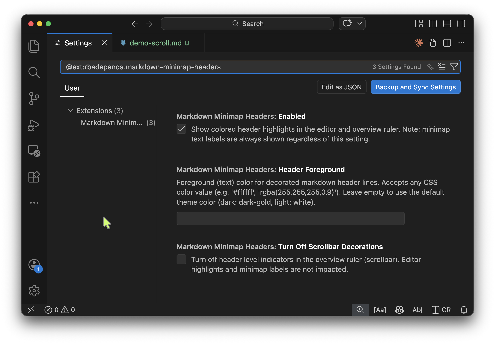

# Markdown Minimap Headers

**See your document structure at a glance — right in the VSCode minimap.**

[](https://code.visualstudio.com/)
[](LICENSE)
[](CHANGELOG.md)

---

AI coding tools use markdown files extensively for agent instructions, memory banks, and project context — `CLAUDE.md`, `AGENTS.md`, `.cursorrules`, Copilot workspace instructions, and more. These files grow fast: behavior rules, tool configurations, workflow guidelines, codebase conventions. Before long you're scrolling through 300 lines of instructions trying to find the one section you need to update.

The same goes for READMEs, design docs, architecture notes, and wikis. If you write long markdown documents, you know the pain: scroll endlessly trying to find that one section, lose your place, repeat. The minimap becomes useless white noise.

**Markdown Minimap Headers** fixes that. It adds three layers of navigation intelligence to every markdown file — and extends into Jupyter Notebooks too:

1. **Header labels** — your `##` headings appear as readable text in the minimap
2. **Scrollbar markers** — each header level gets a distinct color in the scrollbar overview ruler and a background highlight on the header line
3. **Keyboard navigation** — jump between headers without leaving your hands
4. **Jupyter Notebook support** — colored header highlights and cross-cell keyboard navigation for `.ipynb` files

---

## What it looks like

The minimap goes from a wall of grey pixels to a structured document outline. H1 headers are the boldest; H2 through H6 fade gracefully so you immediately understand the hierarchy — all without opening the Outline panel or scrolling.

```
Minimap (before)          Minimap (after)
┌──────────────┐          ┌─────────────────┐
│▓▓▓▓▓▓▓▓▓▓▓▓▓▓│          │■ Introduction  │  ← H1 label
│▓▓▓▓▓▓▓▓▓▓▓▓▓▓│          │░░░░░░░░░░░░░░░░░│
│▓▓▓▓▓▓▓▓▓▓▓▓▓▓│          │▪ Setup         │  ← H2 label
│▓▓▓▓▓▓▓▓▓▓▓▓▓▓│          │░░░░░░░░░░░░░░░░░│
│▓▓▓▓▓▓▓▓▓▓▓▓▓▓│          │· Install       │  ← H3 label
│▓▓▓▓▓▓▓▓▓▓▓▓▓▓│          │░░░░░░░░░░░░░░░░░│
└──────────────┘          └─────────────────┘
```
### With Markdown Minimap Headers Extension


### Before and after comparison


### Extension Settings


The scrollbar overview ruler adds colored markers alongside the minimap — one per header, fading with depth — so you can spot document structure at a glance even without reading the labels.

---

## Features

### Header labels in the minimap

Uses VSCode's built-in folding region support — zero runtime overhead. Your headers appear as readable text labels in the minimap the moment you open a markdown file. No configuration required.

Works with any file VSCode recognizes as `markdown`, including `.qmd` (Quarto), `.rmd` (R Markdown), `.mdx` (MDX), and `.markdoc` (Markdoc).

> Requires `editor.minimap.showRegionSectionHeaders: true` — this is the VSCode default.

### Colored markers with visual hierarchy

Each header level gets its own colored marker in the scrollbar overview ruler, plus a background highlight on the header line in the editor. The color fades with depth so H1 leaps out and H6 whispers:

| Level | Dark theme | Light theme |
|-------|-----------|-------------|
| H1 | Gold — 100% | Blue — 100% |
| H2 | Gold — 70%  | Blue — 70%  |
| H3 | Gold — 40%  | Blue — 40%  |
| H4 | Gold — 20%  | Blue — 20%  |
| H5 | Gold — 10%  | Blue — 10%  |
| H6 | Gold — 5%   | Blue — 5%   |

Theme-aware out of the box. Fully customizable via `workbench.colorCustomizations`.

> Note: VSCode's minimap API does not support decoration background colors — the colored markers appear in the scrollbar and editor only. The minimap shows header text labels via folding regions.

### Keyboard navigation

Jump between headers without a mouse, the Outline panel, or search:

| Command | When to use |
|---------|-------------|
| `Markdown: Go to Next Markdown Header` | Move down to the next heading |
| `Markdown: Go to Previous Markdown Header` | Move up to the nearest heading |
| `Markdown: Go to Next Header in Notebook` | Jump to the next heading across notebook cells |
| `Markdown: Go to Previous Header in Notebook` | Jump to the previous heading across notebook cells |

All commands are available in the Command Palette (`Ctrl+Shift+P` / `Cmd+Shift+P`). The regular next/previous commands work in any markdown file. In Jupyter Notebooks, they automatically fall through to the next cell when no more headers exist in the current cell — so a single keybinding navigates the entire notebook seamlessly.

**Suggested keybindings** — add to your `keybindings.json` (`Ctrl+Shift+P` → "Open Keyboard Shortcuts (JSON)"):

```json
[
  {
    "key": "alt+shift+down",
    "command": "markdownMinimapHeaders.goToNextHeader",
    "when": "editorLangId =~ /markdown|quarto|rmd|mdx|markdoc/"
  },
  {
    "key": "alt+shift+up",
    "command": "markdownMinimapHeaders.goToPreviousHeader",
    "when": "editorLangId =~ /markdown|quarto|rmd|mdx|markdoc/"
  }
]
```

> Tip: `Alt+Shift+↑/↓` mirrors the "move line" gesture (`Alt+↑/↓`) — easy to remember as "jump between sections instead of lines".

### Jupyter Notebook support

Jupyter Notebooks (`.ipynb`) get first-class header navigation. Markdown cells with `#` headings receive the same colored background highlights as regular markdown files, and keyboard navigation works seamlessly across cell boundaries.

- **Colored header highlights** — markdown cells show the same theme-aware background colors per heading level
- **Cross-cell navigation** — the next/previous header commands automatically jump between cells when no more headers exist in the current cell
- **Dedicated notebook commands** — `Go to Next Header in Notebook` and `Go to Previous Header in Notebook` for explicit cross-cell jumps

Decorations are applied automatically as you scroll through notebook cells — no configuration needed.

> Note: Scrollbar markers (overview ruler) and minimap labels are not available in notebooks due to [VSCode API limitations](#known-limitations). Background highlights and keyboard navigation work fully.

---

## Installation

Search **"Markdown Minimap Headers"** in the VSCode Extensions panel, or install from the command line:

```bash
code --install-extension rbadapanda.markdown-minimap-headers
```

---

## Configuration

| Setting | Default | Description |
|---------|---------|-------------|
| `markdownMinimapHeaders.enabled` | `true` | Toggle colored minimap decorations on/off |
| `markdownMinimapHeaders.turnOffScrollbarDecorations` | `false` | Turn off header level indicators in the overview ruler (scrollbar). Editor highlights and minimap labels remain visible. |
| `markdownMinimapHeaders.headerForeground` | `""` | Text color for decorated header lines (CSS color value) |

### Custom colors

Override any header level color in your `settings.json`:

```json
"workbench.colorCustomizations": {
  "minimapMarkdownHeaders.h1": "#FF6B6B",
  "minimapMarkdownHeaders.h2": "#FF6B6BAA",
  "minimapMarkdownHeaders.h3": "#FF6B6B66"
}
```

Color IDs: `minimapMarkdownHeaders.h1` through `minimapMarkdownHeaders.h6`.

The header text foreground color can also be customized:

```json
"workbench.colorCustomizations": {
  "minimapMarkdownHeaders.headerForeground": "#FFFFFF"
}
```

---

### Always show minimap for markdown files

If you use `editor.minimap.autohide`, the minimap may be hidden when you open markdown files. Add this to your `settings.json` to keep it visible for all supported languages:

```json
"[markdown][quarto][rmd][mdx][markdoc]": {
    "editor.minimap.autohide": "none"
}
```

---

## Requirements

- VSCode 1.88 or later
- No other extensions required

---

## Known Limitations

- **Code blocks**: The folding-marker approach (Layer 1) cannot distinguish headers inside fenced code blocks or YAML frontmatter — these may appear as labels in the minimap. The colored decorations and navigation commands correctly skip them.

- **Jupyter Notebooks (.ipynb)**: Scrollbar markers (overview ruler) and minimap labels are not available in notebooks. Background highlights and keyboard navigation work fully — see [Jupyter Notebook support](#jupyter-notebook-support) above.

  | Feature | Notebooks | Regular Markdown |
  |---------|-----------|------------------|
  | Background color on headers | ✅ Works | ✅ Works |
  | Keyboard navigation | ✅ Works (across cells) | ✅ Works |
  | Scrollbar markers (overview ruler) | ❌ Not available | ✅ Works |
  | Minimap labels | ❌ Not available | ✅ Works |

  **Why?** Notebook cells are embedded editors without individual scrollbars. The notebook has one scrollbar for the entire document, but VSCode doesn't provide a public API for extensions to add decorations to it. The [Notebook API](https://code.visualstudio.com/api/extension-guides/notebook) doesn't expose `setDecorations` or overview ruler support for cell editors.

---

## Releasing

```bash
npm version patch   # or minor / major
git push && git push --tags
```

GitHub Actions publishes to the VS Code Marketplace automatically on `v*` tags.

---

## Contributing

Issues and PRs welcome at [github.com/rbadapanda/markdown-minimap-headers](https://github.com/rbadapanda/markdown-minimap-headers).

---

**MIT License** — free to use, fork, and build on.
